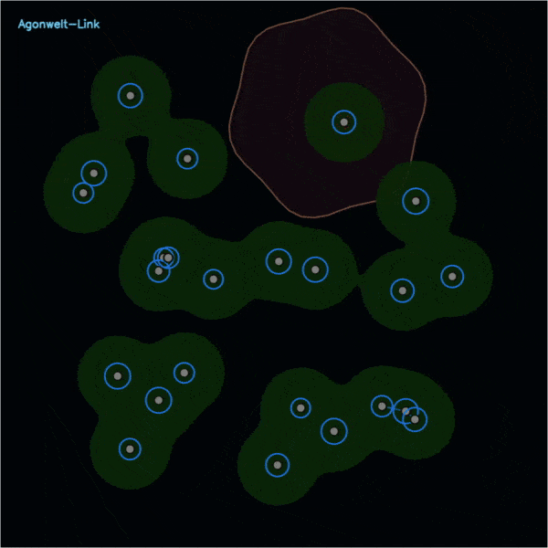

# Agonwelt-Link

**Structures survive through adaptation.**

  
   
  <a href="Agonwelt-Link_v18_Adaptive-Ecology.mp4">
    Agonwelt-Link v18 — Adaptive Ecology
  </a>

---

## What is Agonwelt-Link?

Agonwelt-Link is an experimental artificial ecology project focused on:

- structural survival
- collapse and recovery
- distributed adaptation
- local environmental interaction
- fragmented persistence

Rather than optimizing weights or training centralized intelligence,
Agonwelt-Link explores how structures reorganize, fragment, reconnect, and persist under changing environmental pressure.

---

## Origin of the Name

### Agonwelt

The name is derived from:

- **Agon**  
  (Greek: struggle, conflict, survival pressure)

- **Umwelt**  
  (environment / surrounding world)

Meaning:

> A world shaped by struggle and survival.

---

## Current Demo (2026.5)

This video demonstrates an evolving structural ecology simulation.

Some visible elements in the simulation:

- **Red membranes**  
  → environmental damage / hazardous regions

- **Blue rings**  
  → stable / surviving nodes

- **Gray nodes**  
  → dormant or dead nodes

- **Green membranes**  
  → temporary collective groups

- **Pulse waves**  
  → repair spreading through the structure

- **Torn green membranes**  
  → groups splitting apart

- **Slow pulsing motion**  
  → organism-like breathing behavior

This is not traditional AI training.

This is adaptive structural ecology.

---

## Current Status

- Distributed structural ecology simulation
- Implemented through **v19 (Distributed Homeostasis complete)**
- Verified under continuous collapse / recovery conditions
- Local environmental differentiation implemented
- Partial collective formation verified
- Distributed adaptation propagation verified
- Fragmented persistence stability verified
- Structural continuity maintained without global synchronization

---

## Vision

Agonwelt-Link explores the possibility of:

- distributed artificial ecology
- adaptive survival structures
- non-centralized persistence systems
- local interaction-driven organization
- emergent structural continuity

The project focuses on how unstable structures may continue existing through repeated collapse, recovery, fragmentation, and reconnection.

---

## Core Philosophy

Traditional AI:

→ Optimizes answers

Agonwelt-Link:

→ Explores how structures continue to survive

---

## Notes

- Experimental project focused on adaptive structural ecology
- Not designed for benchmarks or model replacement
- Not intended as AGI research
- Focused on persistence, adaptation, and environmental interaction
- Open to experimentation, observation, and structural exploration

Created by Hideaki Sato (MeshHideaki).

This project is highly experimental.

Feel free to explore, modify, fork, and experiment with it.

Attribution is appreciated.

---

**"Structures survive through adaptation."**
